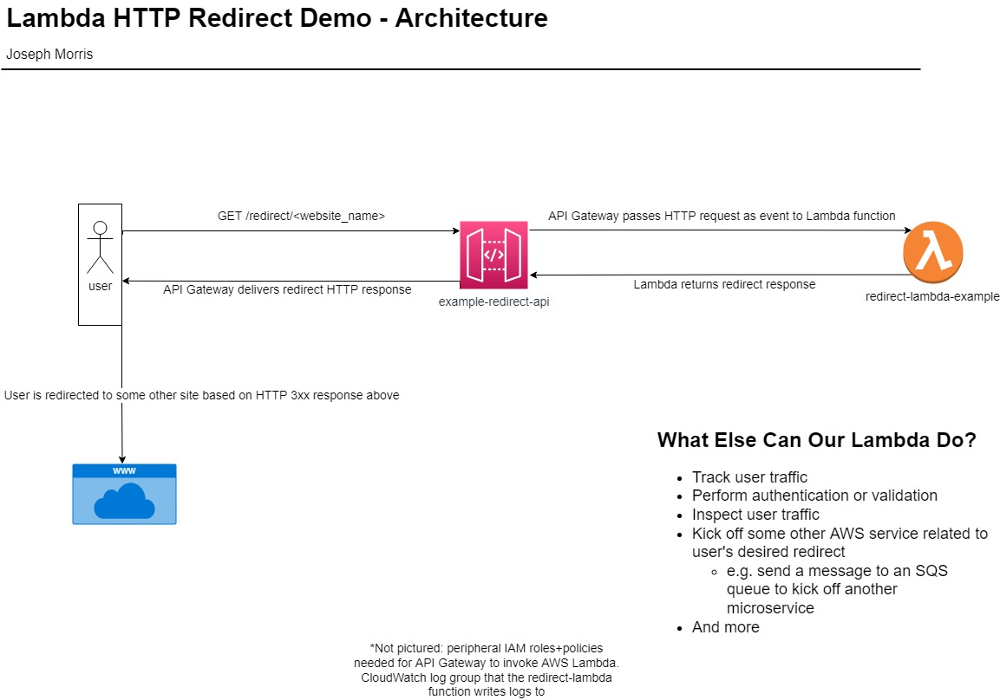

## lambda-http-redirects-demo

A simple Terraform+Python demo showing how to serve HTTP redirects using AWS API Gateway and AWS Lambda

Check out my Medium article for the full write-up

### Architecture Diagram

### Purpose
An example of how to set up a simple API Gateway with Lambda integration to redirect user traffic to another website or host.
This can be useful for a number of reasons, including tracking user traffic, kicking off related microservices, providing an additional layer of authentication/authorization, and so on

### Prerequisites
- An AWS account
- Latest version of Terraform installed on your local computer

### Disclaimer
- DON'T DELETE ANY .tfstate FILES IN THIS DIRECTORY UNTIL YOU'VE RUN A `terraform destroy`
  - This file is how Terraform tracks resources its deployed in this project. It can be safely deleted after resources in this project have been destroyed
- I have done my best to minimize cost associated with this setup. This entire architecture is serverless, and all services used fall within the AWS Free Tier. That being said, if you've exhausted your Free Tier quotas, you may incur small charges for deploying/using this.
- **To control cost, be sure to clean up with infrastructure when you're done with a** `terraform destroy`
- This will launch a **public** API-- while it isn't integrated with any other services in your AWS account and will not allow an attacker to hijack your account/resources, it's still a good idea to minimize threat (and cost) by cleaning up these demo resources after you're done

### How to run
- `cd <this_directory>/terraform/`
- `terraform init`
- [Optional] `terraform plan` to vet infrastructure deployment
- `terraform apply` - enter "yes" to confirm deployment

### How to clean up
- `cd <this_directory>/terraform/`
- `terraform destroy` -  entery "yes" to confirm destruction
- Ensure the above command executes successfully with no errors. Then you're safe to delete anything/everything in this directory